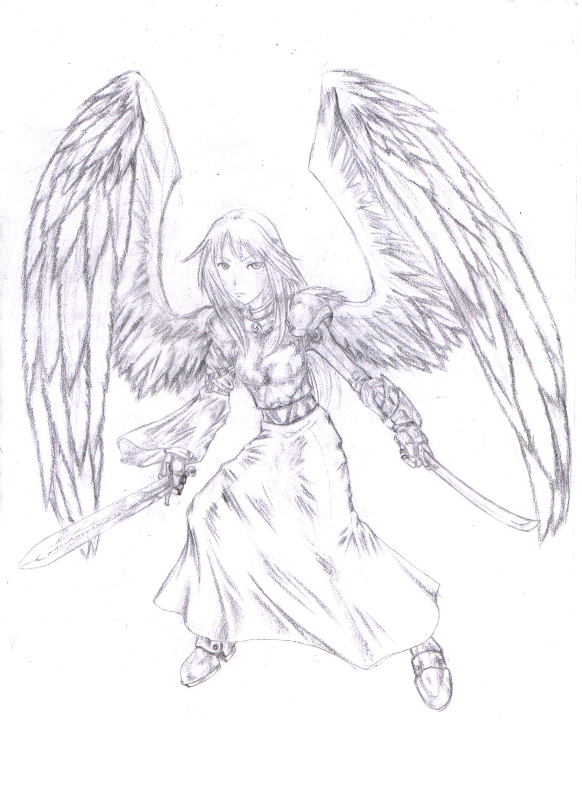

__NOTITLE____NOTOC__

Brave, loyal to friends and fierce in war, Angels are the Children of
[Aeros](Aeros_the_Sky_Lord "wikilink"), the Sky Lord. Because their
species is split into five separate groups based upon speciality, the
Angels are, as a species, flexible and adaptable. However as individuals
the SkyBorn have a tendency towards rigid thinking and niche fulfilling
that can prevent them from achieving their fullest potential. They
believe that everyone has a place in society based upon their skills and
abilities and that an individual should be satisfied with that rather
than striving for more.

Literally born of Aeros' will, all Angels come into being physically
fully grown approximately 100 feet above the ground of their five major
cities. Though physically an adult, these 'Newborn' Angels have the
intellectual level and ability of a five year old. The arrival of these
new Angels is not subtle and by far the majority are adopted into the
loose extended clans that serves Angels as families. Most SkyBorn can
spend their entire lives happily working in the niches that their Breed
has already decreed for them without complaint, serving the needs of
their people and having their needs met in return. Those who show the
rare spark of talent needed to become a spellcaster demonstrate an
affinity for [Air Magic](Air_Magic "wikilink") more than 90% of the
time.

In actuality, joining a Sect is the only way for an Angel to 'escape'
the formality and strict hierarchy of their usual existence. Any Angelic
Sect member, be it a Casting Sect or the brutal [Warrior
Sect](Warrior_Sect "wikilink"), is free to pursue the aims and desires
of the Sect as foremost of their obligations. Naturally the majority of
the Angelic population are not capable of spellcasting, but those who
can are trained most often by superior Angelic spellcasters. If instead
they show an inherent skill with weaponry and the brutal art of hand to
hand combat then these lucky Children of Aeros may well be educated at
the prestigious College of War in the city of War, Elis.

Many of these 'free' Angels revel in the escapism of bring a Sect
member, accepting of the duties and requirements that come with it. Even
taking into account the pressure and stress of the militaristic
organisations the SkyBorn have joined, the Angels are still in
possession of far greater autonomy and free time, the ability to pursue
their own agendas and hobbies. These Angels are inherently unwilling to
give up this freedom and many of them resent the concept of being
assigned to any of the Angelic Cities, viewing it as a return to a
purgatory they did not know they were trapped in until they left. After
all, for those born of the sky, freedom is everything.

## **Opinion of Other Races**

**Anvar** - "Strong, powerful, useful and incredibly hard to kill . . .
yet the Anvar are inherently fools. Born of a deity's disinterest, yet
they desperately cling to the idea that
[Solar](Solar_the_Blinding "wikilink") cares about anything at all in
this universe. Heed not their dogma, but treat them with respect
regardless for an angered Eater of Metal is a dangerous thing indeed."

**Conflaris** - "Honour them for their skill that can rival even our own
Blue Wings, their trade providing our Black Wings with much needed
weapons and armour. They make for talented combatants, tough and wilful,
stubborn almost beyond reason. However be wary as they hold grudges like
no other, their anger slow burning and ever lasting unlike the short
fused DragonLords or Anvar."

**DragonLord** - "They are as varied as the Humans, in their own way,
though it would be wise to never mention that fact to their face. Rage
is the legacy of [Shaltar](Shaltar_the_AllFather "wikilink")'s Children,
pulsing and screaming in their blood. No matter how calm or gentle the
Children of the Dragon seem, remember first and foremost that a monster
lives in the heart of each of them. Consider carefully if their strength
and skill is worth the potential risks."

**Fae** - "Be wary which of
[Javersith's](Javersith_the_Sorrowful "wikilink") Children you ask for
aid, as some are gentle and caring and others are brutal and
uncompromising. Still, we owe this Race a great debt for their aid
during the Great Plague that caused the division of our Race. Help them,
protect them and keep them safe if you can, in repayment for this."

**Human** - "Our relationship with the Humans is . . . complicated. We
exploited their apparent racial memory and fear of 'Angelic' beings
during the Great War to massive effect, something that we, even today,
are not proud of. They are powerful in their own way, being one of the
few Races capable of producing legitimately powerful Psykers, and they
seem to have an inherent knack for most magics. They will never be as
skilled at calling down the lightning as an Angelic Caster, but their
broad skill and flexibility is something to be respected."

**Merfolk** - "Wilfully lackadaisical, the Children of
[Hydros](Hydros_the_Laughing_God "wikilink") are cheerful, swift,
playful and amusing. They also have a worrying tendency towards crime,
pranks and, occasionally, complete uselessness. If you can motivate
them, however, their swiftness, absolute fearlessness and supreme
agility are amazing assets."

**Soulless-Born** - "They are almost Human, but possessed of a nobility
that few others seem to be able to see. Melancholy follows all three of
the Soulless Breeds, but burns fiercest in the youngest, the
Soulless-Born. Lacking the insectile Myrmidons unmatched skill with
magics and the colossal Abaddons phenomenal strength, the 'Born' make up
for it with courage, determination and an implacable drive to honour
their creator, the Nightbringer
[Hevar](Hevar_the_Nightbringer "wikilink")."

## **Physical Physrep**

All Physreps are optional except for the Primary Physrep unless
otherwise stated.

**Wings**; **Primary Physrep.** - To play an Angel you -must- possess
Wings in one of these five shades. Small wings such as those purchased
from Ann ummers or as part of cheap Halloween Costumes are not a
suitable physrep. Angels are known by their large, feathered wings. The
colour varies between the five Breeds, with wing colour being indicative
of their abilities and place in Angelic society.
:The colours available are; [Gold](Gold_Winged_Angel "wikilink") "The
Nobles", [Blue](Blue_Winged_Angel "wikilink") "The Artists",
[Grey](Grey_Winged_Angel "wikilink") "The Diplomats",
[White](White_Winged_Angel "wikilink") "The Builders" and
[Black](Black_Winged_Angel "wikilink") "The Warriors".

**Halo** - The skin of many Angels seems to be lit from above by a halo
of light in the same shade as their wings. This gives them a strange,
other worldly look.
:This can be achieved through the usage of appropriately coloured make
up along the forehead, nose, upper cheek bones, tops of the ears,
shoulders, collar bone and chin.

**Hair** - Angels of the various different Breeds have typical colours
of hair associated with their wing colour.

  -
    More information on this can be found on the relevant Angel Breed
    page.

**Eyes** - Angels often have sharply contrasting eye colour to that of
their wings.

  -
    More information on this can be found on the relevant Angel Breed
    page.

**Clothing** - Angels favour long, flowing robes, togas, stola and
tunics. The colour of their clothing often reflects that of their wings
and halos or sometimes highlights it with complementary or opposing
colours.

**Weapon Preferences** - Angels primarily favour two major different
kinds of equipment when they go to war. The majority of Angels,
including the Black Winged, favour long, stabbing spears, heavy, broad
shields and short blades for up-close work. This flexible array of
armament allows an Angel to defend themselves against the majority of
threats without needing excessive training. The minority of Angels,
especially those trained to fight in the Great Arena in the City of
[Elis](Elis,_Angel_City_of_War "wikilink"), favour more esoteric
weaponry; bucklers and longswords, tridents and punch-daggers, heavy
maces and hammers.

Naturally those trained in the College of War are often schooled in the
basics of nearly every weapon on the planet, with Warrior Sect Angels
often favouring their own unusual combinations. Indeed it has become
common in recent years for Angels to make use of their strength and
speed to wield massive two-handed swords and heavy pole-weapons in place
of their more traditional equipment.

## **Roleplay Effects**

  - **Proud** - Angels are brought into being by the direct will of
    Aeros Himself, something that almost no other Race can lay claim to.
    They are proud of this fact and that their Deity is one of the more
    active in the world. They revel in His presence and His might, and
    gladly argue His superiority with the followers of other reglions.
  - **Brave** - Children of the God of Valour, Angels fear very little
    in this world, especially the mundane. Whilst they can be effected
    by the more powerful forms of supernatural and magical horror, even
    then they strive to avoid displaying their fear openly.
  - **Superior** - Angels are strong, swift, powerful and one of the few
    Races that are granted true freedom in the sky. This has a tendency
    to sometimes make them arrogant and superior.
  - **Isolationist** - Beyond their obligations to the Magus Council,
    the Angel Cities are somewhat isolationist in nature. Though they
    welcome trade and each of their cities has a healthy population of
    other Races, the Angels refuse to take part in other the wars of the
    other Races. Most often they tend to view the problems of other
    people and other Races as just that. Other peoples problems.

## **Names**

Angelic names are typically quite short, though there are exceptions,
and often feature an **'us**' or **'a**' final syllable. As Angels are
not really born so much as brought into existence, many of them
eventually choose their own name. For example:

  -

      -
        Male: *Atellus, Brutus, Canus, Hannibal, Justinus, Labeo,
        Malleolus*
        Female: *Annalis, Bassa, Crispina, Eleanor, Helva, Imperiosa,
        Lucia*

## **Nicknames**

  - SkyBorn
  - Shining Ones
  - The Legions
  - 'Grey' Winged (and so forth for the relevant colour)
  - The Blinding
  - The Blessed
  - The Divided (insult)
  - Pigeon (insult - Vorn City Slang)

## **Worship**

The Angels are fiercely proud in their worship of Aeros, their Divine
Father. They do not kneel before Him, believing instead that they should
be strong and noble in their bearing. They bow their heads in respect,
touching fingertips to lips and heart at the start and end of their
prayers. Heartfelt words and prayers are offered up in place of physical
offerings as the Angels are well aware that the Sky Lord has no interest
in gifts.

These prayers are offered up when the Angel awakens, often as the very
first thing they do upon laying eyes on the blue of the sky, in honour
of their creator. Thunderstorms are also a time to honour Aeros, the
Angel's revelling in the display of their deities might.