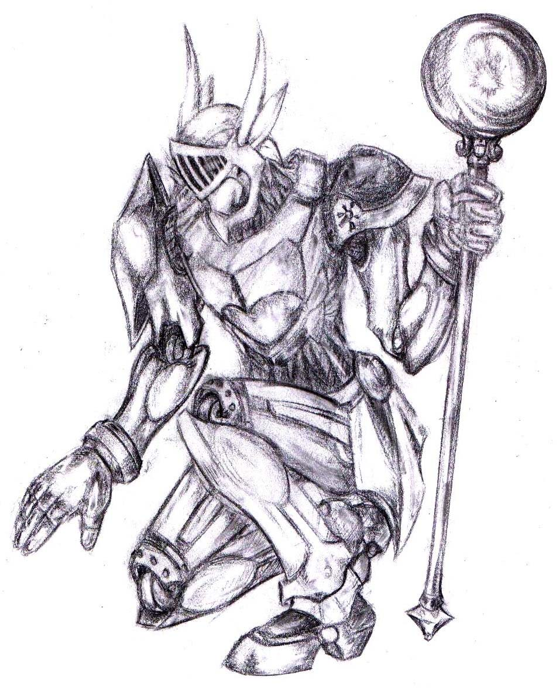

__NOTITLE____NOTOC__

Faith. Faith as hard as steel, as undying as a mountain and as timeless
as the sun. For the Anvar, Children of the Sun, born of
[Solar](Solar_the_Blinding "wikilink")'s might, their faith in their
creator is everything. Generally speaking the Anvar are the tallest,
broadest, heaviest and strongest of all the Elder Races, towering over
even the DragonLords. Of all the Children of the Gods only the Ether
Walkers are taller and the gangly, grey-skinned Psykers are but a
fraction of the Anvar's mass. Easily powerful enough to wield massive
two handed weaponry, bear immense loads and go for long periods of time
without rest, the so called 'Mighty' are consummate shock-troops.

Formed of a living metal known as 'FleshMetal', the Anvar resemble
nothing so much as powerful suits of armour. The specific form and style
of an individual Anvar varies as they are hand crafted by their
'parents' from a collection of materials. By far the majority of Anvar
favour metals, especially ferrous metals, but those raised in urban
environments tend towards a more pragmatic approach, leading to Eaters
of Metal formed instead of leather or other such primitive forms. Other
Anvar have a tendency to look down on those formed of metals less
precious than themselves, though Tal'Vorns inherent shortage of ferrous
metals leads to Iron and Steel Anvar being fourth and second in the
'Ranking', with Gold and Platinum as third and first respectively.
Unlike Angels, there is no formality in this Ranking, simply a respect
for the effort required for an Anvar of those materials to exist.

The Anvar, in rural areas, live in extended tribes lead by the largest
and thus oldest Anvar. The Race grows slowly over their lifetime,
existing on a diet of metals that they absorb into their hands in a
short, five minute ritual. An Anvar can subsit on any metal they come
across, but need the metal they are formed of in order to grow.
Fortunately the higher 'Ranked' Anvar grow more rapidly with a lesser
quantity of the required metal, causing them to be the bigger and more
powerful individuals in their species. The Mighty honour age and power,
holding their Elders in great respect and taking heed of their wisdom in
religion, war and in searching the land for the metals they need to
survive.

Anvar are quite skilled at surface mining, digging shallow pits from the
earth with their immense strength in order to access the metals they
need. However Tal'Vorn's surface is somewhat lacking in metals, let
alone the ferrous that the Anvar favour. Thus the Anvar seek out those
who are in possession of a large store of metal from deeper below the
surface, naturally leading to conflict. The long wars with the great
miners, the Conflaris, Children of Stone, are songs of legend amongst
the Anvar, great tales of courage and faith.

## **Opinion of Other Races**

**Angel** - "Born of sky and air and dust and wind . . . The Angels
should be respected for their honouring of their creator,
[Aeros](Aeros_the_Valorous "wikilink") but that's it. [The
Divided](Angel "wikilink") are twisted and fallen from their greatness
by the separation forced upon them by the vile diseases of the
[Liar](Ievar_the_Liar "wikilink"). If not for the mercy of
[Javersith](Javersith_the_Sorrowful "wikilink") and Her
[Fae](Fae "wikilink") than there would be substantially fewer arrogant
pigeons in the world."

**Conflaris** - "Our eternal foes, the [Conflaris](Conflaris "wikilink")
mine deeply and hoard the metals we need to survive. They often trade
harshly for such materials, especially given our history of shared
warfare, but some can be trusted to have honest dealings. They are
tough, strong, hard to kill, talented smiths and very good with their
hands however, and thus should be approached with the appropriate
caution."

**DragonLord** - "The faith of the [DragonLords](DragonLord "wikilink")
burns brightly and for that we hold them in high respect. Their skill as
warriors and shock-troops is impressive as well. Their temprament is
less than stellar however, the race being prone to bursts of rage and
all together lack the proper control. They can be useful allies, but
take their word with a pinch of salt. It will last only as long as their
temper, regardless of their declarations of faith and honour."

**Fae** - "The [Fae](Fae "wikilink") love their Goddess,
[Javersith](Javersith "wikilink") and their Race is a reflection of
their creator, which is only right and just. The little healers are
useful and kindly, but also highly dangerous if you fail to look past
their fragile frames and delicate demeanour. Those who worship the
darker aspects of Javersith, especially that of 'sorrow' for they are
dangerous indeed should they be slighted or angered."

**Human** - "Take each of them at their own value. We fought extensively
with them during the Great War and have done on several occasions since
and found them to be strong opponents on each occasion, but still yet to
show themselves worthy of our respect."

**Merfolk** - "The swift and playful [Merfolk](Merfolk "wikilink") are
amusing in their own way, quick with a joke or a prank and good with
their hands. They are not bad fighters or Casters either, their speed
and agility, combined with a surprising strength, making them quite
useful. They lack the endurance for a drawn out fight, but that is not
normally an issue for the Swift-footed."

**Soulless-Born** - "Some are the ideal of the noble, faithful warrior,
blessed and strong in their worship of the
[Nightbringer](Hevar_the_Nightbringer "wikilink") and we love them for
it. We are happy to walk along side these warriors into the dark places
and glad to call many of them friends. But some of them have fallen into
darkness. Twisted by the ennui of their existence, of the very
soullessness that is their namesake, they turn away from the face of
their creator and embrace chaos and destruction. These
[Soulless](Soulless-Born "wikilink") we will destroy without mercy."

## **Physical Physrep**

All Physreps are optional except for the Primary Physrep unless
otherwise stated.

**Armour**; **Primary Physrep.** - Anvar are living suits of armour,
constructed of a material known as 'FleshMetal'. To play an Anvar you
need to cover as much of your body as possible in a suit of armour, be
it leather, plate, mail or 'plastic-plate'. The head must be covered by
a helmet, preferably full face, at all times. Areas uncovered by armour
must not display naked skin. This can be achieved through appropriate
make-up, gloves, scarves, padded jacks and so forth.
:Anvar are split broadly into different 'weight' classes based upon the
material used for their construction; [Light](Light_Anvar "wikilink")
(Leather), [Medium](Medium_Anvar "wikilink") (Copper, Bronze, Silver),
[Heavy](Heavy_Anvar "wikilink") (Gold, Iron) and
[Superheavy](Superheavy_Anvar "wikilink") (Steel and Platinum). The
heavier a weight class that you desire to play, the more of your body
needs to be encased in the relevant suit of armour.

**Glowing Eyes** - The eyes of an Anvar glow from within their helm, in
a variety of bright colours.

  -
    This can be achieved through brightly coloured or UV contact lenses,
    or by mounting small coloured LED's inside the helm.

**Golden Blood** - Should an Anvar be injured, and their FleshMetal
cracked or shattered, then the blood that oozes and pulses free is a
rich golden colour, like liquid sunlight.

  -
    This can be achieved with a suitably coloured form of fake blood.

**Clothing** - Anvar often cover their FleshMetal with simple tunics,
leather jerkins or waistcoats, heavy Caster robes or waist cinches. This
can be used to cover areas of skin that are otherwise uncovered by
armour.

**Weapon Preferences** - Anvar are immensely strong, almost without
trying and thus favour heavy, two-handed weaponry, especially maces,
mauls, clubs and hammers. Those who need to fight for an extended time
on the front lines or as part of a ranked up unit make extensive usage
of immense, kite-shaped tower shields and brutal one-handed melee
weapons. All told the Eaters of Metal are blunt instruments of
destruction and thus favour blunt weaponry when rendering destruction.

## **Roleplay Effects**

  - **Devout** - An Anvar's faith gives them strength, allowing them to
    shrug off damage, pain, spells, fear and horror. They worship avidly
    and without fail, their religion a primary and driving aspect of
    their lives.
  - **Loyal** - Once you have made a friend of an Anvar, they are true
    to the very bitter end. An Anvar would follow you into the jaws of
    [Demons](Demon "wikilink"), the heart of a [Mist
    Devil](Mist_Devil "wikilink") and into never ending war. They are
    true and honest and devoted to their friends and allies.
  - **Untiring** - The FleshMetal bodies of the Anvar are almost beyond
    exhaustion and fatigue is a distant concept to them. Mentally they
    can remain alert for days on end before requiring rest and the only
    reason for them to stop fighting is if damage to their bodies
    becomes to great to bear.
  - **Fanatical** - An Anvar's faith in solar is beyond reason, beyond
    persuasion and well beyond conversion. Many pay service to other
    Gods as well, but all are raised from birth to pay homage to the
    Great Star. They actively seek out converts to Solar's worship,
    encouraging all they meet to fall upon their knees and offer up
    homage and offerings. Indeed an Anvar will often stay their hand in
    combat if their foe surrenders and vows to convert.

## **Names**

Anvar favour simple and straightforward names, typically consisting of
one syllable or so. However, because Anvar lack a distinction between
the two sexes the names have no gender basis. For example:

  -

      -
        *Al, Cay, En, Kai, Ki, Nev, Mer, Sen, Zi.*

## **Nicknames**

  - Eaters of Metal
  - Steel Fleshed
  - Empty Ones (insult)
  - The Mighty
  - SunChild
  - The Deceived (insult)
  - The Blind (insult)
  - Tinman (insult - Vorn City Slang)

## **Worship**

For the typical Anvar, religion is the core of their existence. Praise
to Solar, the Shining One, is vitally important. The Sun is a holy
object, home of the Anvar's creator. Anvar kneel, arms outstretched and
face turned towards the light. They revel in the dawn, in the first
light of the sun, in the strength of it at noon and mourn for it as the
night comes. The Anvar sing and declaim prayers loudly, as if trying to
impress Solar with the volume of their faith.

Though Solar has little interest in offerings, this does not stop the
Eaters of Metal from offering up all sorts of totems, hand-crafted
relics, the heads of enemies and valuables. They hope that something
will spark the Uninterested One's attention, draw His gaze down upon His
faithful but lost children. It has not yet worked.