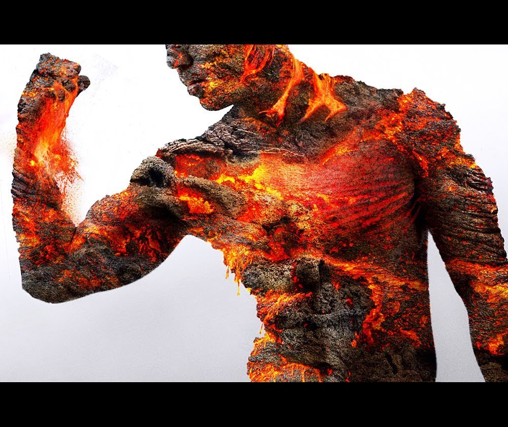

Typically short and broad, Conflaris seem built for their mountain
homes. With arms as thick as a man’s thighs and flesh of true living
stone, the Children of Asgar’s endurance is phenomenal. This coupled
with the Conflaris’ natural hot-headedness can make the short warriors
surprisingly hard to bring down in combat. They are shorter on average
than humans, though they weigh slightly more. Conflaris males typically
possess short hair or beards although exceptions exist, and female
Conflaris traditionally do grow long top knots. These are typically
braided and plaited through with brightly coloured ribbons and gem
stones. They perform the same duties as the male Conflaris, mining,
stone working, weapon-crafting, selling wares and looking after the mine
animals as Conflaris society is primarily based on the merit of the
individual, as opposed to some sort of inherited position.

Conflaris are stubborn beyond common sense, preferring to cling to an
incorrect argument, no matter how clearly it is wrong, rather than
concede the point to their opponent. This passes over into their common
lives, making each Conflaris driven by honour, desiring to fulfil their
word as if they have no other choice. If a Conflaris says that he will
do something, then nothing short of an army standing in his way will
stop him and even then only once they have hacked the Conflaris to
death. Conflaris are tenacious in defence and nigh unstoppable on the
attack, their sheer endurance allowing them to face against foes that
outstrip them, or numbers far greater than anyone should sensibly face.

Conflaris resolve their decisions and debates through acts of physical
prowess. The most typical method they select is either wrestling or the
lifting of weights. They are also quite boisterous and cheerful, given
to enjoy great feasts of meat, breads and ales. Hot-headed and fiery
tempered, the Conflaris truly are the children of the Volcano God,
Asgar, however, and are given to swift rages that flare and pass
quickly.

The Conflaris are found in most of the human cities, having dedicated
quarters in the larger two, Grath and Vorn. However, their largest
population is in their two cities, the mountain Drazzahezz and the
orbiting planet Dragons Eye. Conflaris and the gangly, grey skinned
psychic Ether Walkers crafted a Jump Gate to Dragons Eye and there built
a small city to mine the planetoids precious iron. It is from here that
most of Tal'Vorn's weapons come from, forged from the red rock of the
moon.

## **Opinion of Other Races**

**Angel** - "The [SkyBorn](Angel "wikilink") almost fear the warm
embrace of the earth, unheeding of its slow and glorious wonders.
Instead they flit about from mountain top to mountain top, barely
deigning to touch the good ground below. Their cities are carved from
beautiful but dead marble and this grieves us, their isolation from the
living stone. Still, their artisans do good work with the gems and
precious ores they buy from us and we can respect skill, if nothing
else."

**Anvar** - "Bah, armoured thieves and little more. We would happily
trade with the [Tinmen](Anvar "wikilink") but the proselytising
psychopaths insist on either their own terms or mortal combat. Whilst we
enjoy and relish competition it is not worth getting your skull staved
in over a few Tarl Marks worth of iron ore. Sell to them if you must,
but half the time it is still cheaper to hire DragonLord or Soulless
bodyguards, which is frankly ridiculous. Respect their strength but
beware their single mindedness."

**DragonLord** - "Generally speaking we have a high opinion of the
[Blood of the Dragon](DragonLord "wikilink"). Their honour means they
cannot break deals, they are regular weapon and armour customers and
make superb bodyguards. So long as you are not intending to trade with
any humans . . . They have a similar physical approach to resolving
their issues as we do and seem to relish the challenge of brawling or
wrestling. This shared enjoyment makes finding peaceful outcomes to our
occasional disagreements surprisingly simple."

**Fae** - "The Children of Javersith are devoted servants of their
Goddess and we respect them for it. The Crafter,
[Terra](Terra "wikilink"), is Divine Husband to the
[Sorrowful](Javersith_the_Sorrowful "wikilink") and thus close links
between our peoples have been fostered for generations. Indeed there is
a large enclave of the [Fae](Fae "wikilink") in
[Drazzahezz](Drazzahezz "wikilink"), living in peace and earning a
living as shop keepers, merchants and servants, as well as their
traditional roles as Healers and surgeons. Some of the other races have
a mocking opinion of the Fae and this we will tolerate no more than if
we were insulted ourselves."

**Human** - "Being far and away our most numerous customers, the Humans
are interesting enough. Sufficiently varied to avoid being boring, the
'[Invaders](Humans "wikilink")' have responded about as well as could be
expected to the planets rampant hostility. Avoid letting any DragonLord
associates become aware of your trades and dealings with the Numerous
and all should be fine. Be cautious of their fierce ambition however as
their greed and need for power can grow out of hand and lead to foolish
or violent incidents. In this situation it would behove you to remind
the Humans that we do more than simply forge the axes and hammers we
carry."

**Merfolk** - "Fickle would be the best way to describe the Children of
the Sea. Swift, agile, mirthful and playful, the
[Peaceful](Merfolk "wikilink") make for useful and amusing allies most
of the time, provide they are not picking your pockets for the
entertainment value. We provided their capital,
[Haltimeran](Haltimeran "wikilink"), with much needed metals and our
skills when stagnant water threatened to make the city uninhabitable and
the [Tropics dwelling Merfolk](EpipelMerfolk "wikilink") have been
suitably grateful ever since. Those who dwell deeper however sometimes
seem to lack their cousins easy-going nature and happy-go-lucky nature.
Be cautious of those who dwell in the deeps, for reading their needs and
desires is difficult at best."

**Soulless-Born** - "One of the younger Races, the Soulless served with
distinction during the Great War and, so far as we can tell, the
human-like '[Born](Soulless-Born "wikilink")' have not let the legacy of
trust and honour fade. Some might fall to despair but that happens to
all, even our own kin, and is no grounds for suspicion. If you can
overcome their disturbing nature and frankly maudlin attitude, then they
can make for useful trading partners and exceedingly powerful
bodyguards. The majority of the Soulless-Born are strongly dedicated to
the [Nightbringer](Hevar_the_Nightbringer "wikilink") and since Hevar is
the God of Law, this makes His Children extremely interested in obeying
the tenants of any contracts or agreements they enter into."

## **Physical Physrep**

**Cooled Flesh**; **Primary Physrep.** - The flesh of a Conflaris looks
like cooled stone, that cracks and shifts as they move and talk. The
glow of their blood shines through these cracks, giving them the
appearance of half-set lava. This flesh is warm to the touch and almost
as pliable and sensitive as normal skin, though it resists cutting and
blunt damage superbly. This skin cools when the Conflaris is still and
recracks as they speak. This means that a Conflaris' skin patterning
might possess generally similar shapes but is not always identical from
day to day. The specific colour of the stone varies with the Bloodline
of the Stonebones.

  -
    This can be physrepped in a number of ways, including appropriate
    make up, latex prosthetics or a half-face mask. A pleasing effect
    can also be achieved by mixing tissue paper with latex, applying it
    to the face in a suitable fashion and then painting it with
    appropriately colour acrylics. If layered in sufficient thickness,
    this can then be carefully peeled off and reapplied at a later date.

**Born of Stone**; **Required Choice.** - All Conflaris have flesh of a
specific type of stone, born in lineages and Bloodlines that are
strongly defined. Collectively knowns as the 'Gifts of Terra' as the
original Conflaris Bloodlines were hand-crafted by the
[Forgelord](Terra_the_Smith "wikilink"), these lineages are born
innately skilled or different from the other Bloodlines.

  -
    The Bloodlines are as follows; [Basalt](BasaltConflaris "wikilink")
    - *The Unbreakable*, [Diorite](DioriteConflaris "wikilink") - *The
    Strong*, [Granite](GraniteConflaris "wikilink") - *The Immovable*,
    [Marble](MarbleConflaris "wikilink") - *The Defenders*,
    [Obsidian](ObsidianConflaris "wikilink") - *The Surgeons*,
    [Serpentine](SerpentineConflaris "wikilink") - *The Wrathful*

**Lava Blooded** - The blood of the Fire Born is, appropriately, hot to
the touch, sufficient to cause low level burns in non-Conflaris it comes
in contact with. This makes surgery upon one of the Smiths a tricky
proposition at best.

  -
    This can be physrepped with appropriately colour fake blood for
    injuries and wounds.

**Eyes** - Many of the Stonebones have distinct eye colours, reminiscent
of lava or magma, sometimes almost luminously bright.

  -
    These can by physrepped with appropriately coloured contact lenses.

**Hair** - A lot of the Resilient favour braiding their hair back in
decorated patterns, looped and tied carefully to keep it out of the way
during combat and work. Both males and females adorn their hair with
bright beads or jewels, often painted or etched with delicate patterns
and geometric markings.

  -
    You can physrep this with appropriate hair styling, wigs or
    dreadfalls.

**Clothing** - Clothing that is hard wearing, tough, suitable for work,
preferably non-flammable and often festooned with pockets is the
Conflaris standard. Generally formed of linen, heavy leather or wool and
often decorated with silk embroidery of geometric triangular or square
patterns, the clothing is normally very finely made.

**Weapon Preferences** - Heavy chain and tough thick leather form the
usual Conflaris armour of choice, though they have been known to wear
thick plates of steel or iron if going into a truly dangerous combat
situation. Round shields, heavy axes, brutal hammers and short, stabbing
swords are favoured in the chaos of combat. Often the Conflaris decorate
their weapons with repeating patterns or mark them with powerful
enchanted runes to give them greater power.

## **Roleplay Effects**

  - **Stubborn** - A choice once made is inviolate to the [Spark of the
    Volcano](Asgar "wikilink") and they are incredibly difficult to
    deter. Persuasion does work, but one's argument needs to be flawless
    and to the point, or it is likely to be dismissed out of hand by the
    Stonebones. This stubbornness and determination has its benefits as
    they are also ferociously loyal once they have chosen their allies
    and friends.
  - **Focused** - Once a Fire Born has started work on a project,
    especially one involving metal or stone, they are supremely focused
    and difficult to distract. They can spend hours working on the
    filigree of a single portion of a much larger project in order to
    assure that it is absolutely perfect. Complete and total precision
    is the aim and, being the Children of the [Smith](Terra "wikilink"),
    their craftsmanship holds an almost religious importance.
  - **Gregarious** - The Conflaris are unlikely to partake in heated,
    shouted arguments or hold grudges amongst their own Race for any
    length of time. Instead they resolve their issues through physical
    contests of strength or skill, enjoying wrestling, brawling,
    lifting, axe throwing, drinking contests or climbing. When not at
    war, they enjoy partaking in great feasts, highlighted with the ales
    the Resilient are famous for brewing.
  - **Immoveable** - Heavy armour carried into battle as if it weighs
    nothing, flesh of stone almost untouchable by blades and a will like
    the face a cliff, the Conflaris are as unheeding of pain and
    suffering in combat as they are determined and uncaring of the odds.
  - **Mercantile** - The majority of the Smiths are skilled in gauging
    the worth of goods, especially those crafted with metal and hammer.
    They drive hard but fair bargains, calculating the worth of an item
    down to the last copper. This has garnered them a somewhat miserly
    reputation but the truth of the matter is that a Conflaris simply
    knows well how valuable everything they own is and are unwilling to
    pay more than what items and people, in the case of mercenaries or
    employees, are worth.

## **Names**

Conflaris names are like the people, blunt and to the point. Though not
so brief as Anvar names, they still favour shorter and less complex
references to themselves. For example:

  -

      -
        Male: *Áki, Egil, Finnr, Ríg, Snorri, Váli*

<!-- end list -->

  -

      -
        Female: *Auda, Hildr, Ingrid, Nessa, Sif, Valdís*

## **Nicknames**

  - Fire Born
  - Spark of the Volcano
  - The Smiths
  - Knee-high (insult)
  - Stonebones
  - The Misers (insult)
  - Resilient
  - Pebble Dash(insult - Vorn City Slang)

## **Worship**

Crafting weapons, armour, buildings, great works of art . . . all of
these things are, to the Conflaris, acts of worship holy to their
creator, Terra. The Smith is a straight-forward deity, holding His
children close to His heart and gladly bestowing blessings upon the most
faithful. Prayers are often spoken as the Conflaris works, especially
when they are putting the final touches to a piece that they have
laboured long over. Simple axes or a set of chainmail does not warrant
the calling down of Terra's attention but the weapon a Conflaris intends
to take into a dangerous war, or one that they are crafting for their
children to use in their first fight; that is worth asking Terra to
empower the runes that the Stonebones etch into their blades.

The Conflaris are unique, however, in that they are not the product of a
singular creator, but instead the dual effort of Terra and His Divine
Son, the Volcano Lord, Asgar. Terra crafted the Fire Born and Asgar
breathed life into them, the literal Spark of the Volcano. The worship
of the [Strong](Asgar_the_Strong "wikilink") is much simpler for the
Resilient, with great celebrations being held multiple times a year,
highlighted with feasts and immense tournaments of strength, wrestling
and physical competition. To claim victory at such tourneys is a great
honour and the winner is given pride of place at head of the table,
above even the nobility and royalty of the Conflaris people. A victor is
gifted with a title, an additional name that is typically attached to
the end of a Conflaris' name; **Erobrer**.