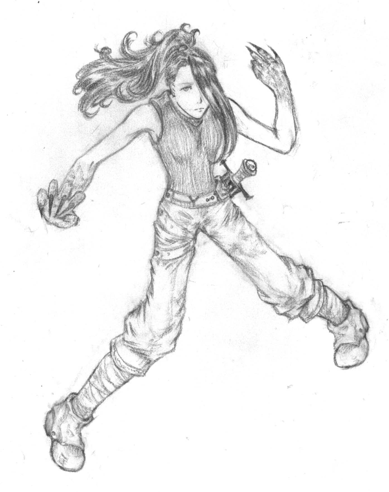
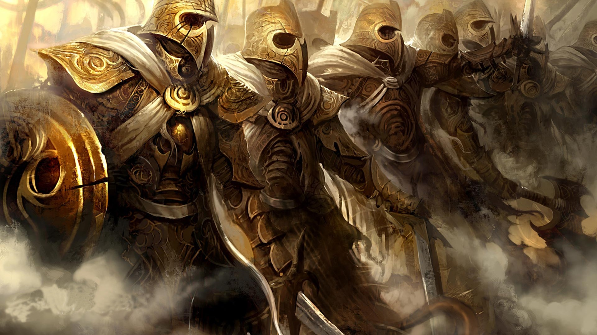

Born to bring death, warriors without peer, the Children of Shaltar are
the ultimate expression of harnessed rage. Fearless, heedless of
numbers, uncaring of pain, swift, strong, and almost impossible to
permenantly put down, the DragonLord Race are true scions of the [God of
War](Shaltar_the_AllFather "wikilink"). Formed of extended, related
clans, the Blood of the Dragon are, nowadays, few in number, but tend to
dominate all other life in their hunting grounds. They were the first
true Race to be crafted upon the Gods arrival upon Tal'Vorn, Shaltar
taking the essence of Dragon, Hydra and Wyvern and distilling it into a
proud, wrathful humanoid form. As there are twelve breeds of Dragon, so
there were twelve FirstBorn DragonLords and DragonLadys. Their might was
unequalled and the clans that sprang from their image still exist today,
strong and fierce, the Blood laughing in the face of death.

Externally resembling taller, more powerful humans, the similarity stops
at the surface of the skin. DragonLord flesh is inherently regenerative,
their healing rate absolutely insane. A wounded and near death
DragonLady could be back on her feet and ready to fight within hours of
the injury, with no visible sign of ever having been hurt. Their blood
is thick with antibodies and oxygenating blood cells to the point where
it is practically black, the Honourables' muscles do not produce lactic
acid and instead simply regenerate faster than stress damage can be
dealt. Twin hearts pulse in opposition, even as lung coated in leathery
plates suck in their massive capacity of air, pressing against the
ossified ribcage and sternum plate dividing and protecting the two
pulmonary organs. Their muscles are dense and inter-coiled, giving them
excellent strength and redundancy, as well as possessing excessively
thick and strong bones and much higher reaction times due to their
triple thickness spinal column.

As they age, DragonLords become more powerful and begin to manifest so
called 'Biomorphing' abilities. Basically they can temporarily transform
parts of their bodies into a more draconic form, growing claws, scales,
wings, a powerful breath weapon and a number of other useful abilities.
Since all DragonLords are functionally immortal, their regeneration
ensuring that old age and disease at least are two factors that are not
relevant in their survival, this simply means that the older a
DragonLord manages to be, the stronger they are. Once past a certain
age, there is little that is a threat in a one-on-one fight, but due to
their combative natures and absolute fearlessness, most DragonLords will
never live to see their fiftieth year, let alone their five-hundredth.

## **Opinion of Other Races**

**Angel** - "They are brave enough these SkyBorn, and we respect the
skill of the Black Winged if nothing else. Generally speaking, their
'Artisans', the Blue Winged do not produce anything of interest to us,
being focused on trinkets and jewels. Beyond anything else however we
still remember how many lives were lost by their refusal to join the
Great War. This is not something we may never be able to forgive.

**Anvar** - "The Eaters of Metal are true and tested battle kin to the
Blood of the Dragon. Our joint devotion to our Gods, Solar and Shaltar,
our primary focus in combat as devastating shocktroops and our shared
bloodymindedness makes us perfectly suited to working together. If the
Mighty can just see past their obsession with conversion over to their
form of religious dogma then we gladly accept them into our battle-lines
and WarTribes."

**Conflaris** - "Tough, stubborn, resilient . . . the Children of Asgar
are solid fighters and supremely skilled weapon and armour smiths. We
can put their skills to good use and the Conflaris gladly brought
powerful cannons to shatter the walls of Primus during the Great War.
They did this without hesitation and without fee, knowing that the War
was just and right. For this we owe them a large debt, one that we and
our descendants gladly pay."

**Fae** - "Ahh the little healers. Naturally any Race as skilled as they
at the surgical arts has a place behind our defences. Just because they
keep troops alive does not mean we should respect them however. Defend,
save and protect them, yes, but respect? No. We do not respect the weak,
no matter how useful they may be."

**Human** - "Invaders. Traitors. Usurpers. Cowards. Filth."

**Merfolk** - "Our Blue Blood siblings think highly of the Merfolk for
some Godsforsaken reason best known only to them. Generally speaking,
their agility and strength make for useful fighters but they favour a
more hit-and-run approach than that favoured by most of the Blood of the
Dragon. Mayhap the [Mirthful](Merfolk "wikilink") may have more in
common with the Red Blood than the Swift would be willing to admit.
Ultimately their need to run their mouths, the blasted broad Haltimeran
accent and inability to sit still for more than thirty seconds at a time
can rapidly grow boring, then tiresome and finally just aggravating."

**Soulless-Born** - "Some things in life are just aggravatingly
confusing. The Soulless-Born are a prime example of this. Their siblings
are absolutely inhuman visually but beyond the eyes, the Doomed look
physically identical to the Traitors. Fortunately they smell differently
and mentally could not be any more worthy of our respect. They are
honourable, dependable fighters, strong in their faith to Hevar and
extraordinarily tough and resilient. They have a tendency towards the
maudlin but this is understabale for a Race who, after death, can never
ascend to be with their maker."

## **Physical Physrep**

All Physreps are optional except for the Primary Physrep unless
otherwise stated.

**Scars**; **Primary Physrep.** - From birth DragonLords and DragonLadys
partake in violent mock 'fighting', a form of play and training that
prepares the Perfect Warriors for an existence of honourable combat and
glorious war in the name of their
[AllFather](Shaltar_the_AllFather "wikilink"). DragonLord flesh is
regenerative, sealing over and healing within hours without wound or
scar, but it is not perfect. Damage taken from magical spells or
enchanted weapons heals slowly, leaving neat scars. In addition, the
skin, teeth and nails of Draconic creatures, including Shaltar's
Children, secretes an oil that slows this regenerative process, leading
to young Berserkers often being criss-crossed in neat, brutal scars.

**Hot Blood of the Dragon**; **Required Choice.** - All DragonLords are
directly descended from one of the twelve FirstBorn, able to trace their
line with pride to one of the mightiest creatures that has ever walked
Tal'Vorn's face. Though the bloodlines have become mixed now, throwbacks
occur, such as a Red Blood being born to Black Blood parents happen on a
regular basis and even mixed parentage gives no guarantee of a childs
Blood.

  -
    The colours of Blood available are as follows, in order of the age
    of the FirstBorn and thus prestige;
    [Black](Black_DragonLord "wikilink") "The Strongest",
    [Green](Green_DragonLord "wikilink") "The Unkillable",
    [Night](Night_DragonLord "wikilink") "The Mad",
    [White](White_DragonLord "wikilink") "The Peaceful",
    [Grey](Grey_DragonLord "wikilink") "The Stubborn",
    [Red](Red_DragonLord "wikilink") "The Swiftest",
    [Gold](Gold_DragonLord "wikilink") "The Wisest",
    [Silver](Silver_DragonLord "wikilink") "The Skyborn",
    [Blue](Blue_DragonLord "wikilink") "The Oceanborn",
    [Copper](Copper_DragonLord "wikilink") "The Volcanoborn",
    [Bronze](Bronze_DragonLord "wikilink") "The Earthborn",
    [Stone](Stone_DragonLord "wikilink") "The Toughest".

**Sharp Teeth** - DragonLords are born hunters, predatory and
carnivorous from birth. Some who are strong in the Blood, with fewer
generations separating them from their FirstBorn, may be born with razor
sharp killing teeth.

  -
    These can be physrepped with any appropriate sharp teeth
    prosthetics. The intent is to look predatory and dangerous, not like
    a vampire or a needle-toothed fish.

**Scales** - Many DragonLords can grow thin layers of hardened scales,
serving them as a secondary form of armour. Indeed some choose to go
near enough sky-clad, trusting in their natural might and strength to
see them through combat, honouring Shaltar with their courage.

  -
    These can be physrepped with make-up or prosthetics. You do not need
    to cover the entire skin with scales, simply highlight

**Wings** - DragonLords and DragonLadys can grow large, reptilian wings
from their upper shoulders as they age and grow stronger. Naturally
their biomorphing allows the Perfect Warriors to grow or retract these
wings at will, though it causes pain and takes time.

  -
    You can physrep this with an appropriate set of foam or cloth wings.
    These require an EXP spend from the appropriate DragonLord Skill
    Tree.

**Claws** - As they age and the Blood of the Dragon pounds louder in
their veins, many DragonLords manifest ripping, cutting claws on their
hands. Indeed in some these become long and hooked enough to use as
close melee weapons. Additionally because of the way that DragonLord
biomorphing functions, they can grow and retract these claws at will,
restoring their hands to their usual humanoid appearance.

  -
    You can physrep this with prosthetic claws, or with appropriate safe
    combat claws. These will be subject to stringent weapon testing
    before you will be permitted to use them in combat. These require an
    EXP spend from the appropriate DragonLord Skill Tree.

**Black Blood** - DragonLord's possess blood so dark and full of white
and red blood cells as well as platelets and other clotting agents that
it appears black under most forms of light.

  -
    This can be physrepped with the appropriately colour fake blood for
    injuries and wounds.

**Clothing** - The Children of Shaltar favour practical, close fitting
clothing that enables them the maximum of mobility and flexibility, in
keeping with their perpetual readiness for combat. They favour simple
armour over ornate full plate, trusting to their physical agility,
resilience and endurance, as well as their rapid regenerative abilities,
to make up for the shortcoming.

**Weapon Preferences** - The strength of the average DragonLord and
DragonLady is such that basically any weapon is suitable for their
purposes, even damaged or blunt swords. Many of the Breeds honour their
FirstBorn by choosing to wield the weapon that was favoured by those
ancient DragonLords and DragonLadys. The Honourable have also been
responsible for developing a unique defensive item called a Bladed
Shield. Effectively a circular shield with segments cut out so it now
resembles a curved Y, with all the edges sharp and bladed, the
Berserkers have turned even their defensive objects into weapons of war.

## **Roleplay Effects**

  - **Rage** - Inside every DragonLord is a thing of rage and hate
    coiled and snapping behind the iron bars of the Honourable's
    willpower. However this thing, this Beast, is caged only for so long
    and anger bubbles close under the surface of every DragonLord and
    DragonLady. It gets worse in the younger generations; the further
    removed from their FirstBorn a DragonLord is the louder and longer
    the Beast howls to be free.
  - **Honour** - A counter to the rage and hate that fuels the
    DragonLords is their deep-rooted sense of honour. An unarmed
    opponent is likely to be allowed to live, provided the warriors
    blood is not filled with the killing rage. A DragonLord typically
    does not break their word if given upon their FirstBorn or upon
    Shaltar, though a promise made to a [Traitor](Human "wikilink") is
    worth less than nothing.
  - **Contempt** - Though the Perfect Warriors respect the powerful and
    the skilled, they have little time or patience for the weak. If an
    individual is useless, or worse, a coward, than a DragonLord will
    have nothing but contempt for them. However, should one of the Races
    strive to be better than they are, to be stronger, faster, braver,
    than they will find a patient and caring mentor in the Children of
    the Dragon.
  - **Fearless** - Fear is a foreign concept to the Bersekers. Indeed,
    Shaltar's Children are far more likely to respond with rage when
    confronted with something horrifying than they are with an actual
    fear response. Its not so much flight or fight as just constant,
    screaming, frothing fight.
  - **Animalistic** - The Blood of the Dragon are born predators,
    generally carnivorous and have an odd tendency to trigger absolute
    horror in livestock. Their sense of smell is superb and many
    DragonLords will scent the air when meeting someone new to memorise
    them better or whilst tracking a foe.

## **Names**

DragonLord names are very important to them, especially titles. Titles
are typically descriptive terms, short phrases that describe the
Children of Shaltar more specifically, giving enemies and allies alike a
clear understanding of the creature that stands before them. They tend
to gather both names and these phrases avidly, using their own titles
extensively. They also refer to other people by their titles just as
much as their names. As an example of a full DragonLady name; **Iris
ArcingBlow, the Wrath Remade, the Hate that Laughs, Grace and War,
Daughter of Arcis FallBreaker and Angelica SongMaker**. Other examples
of names include:

  -

      -
        Male: *Alexis, Draco, Drake, Jxom, Oriss, Siac, Sintai, Woir*

<!-- end list -->

  -

      -
        Female: *Arwen, Ifba, Letanoda, Melanie, Nalhin, Osath,
        Rhyghamos*

## **Nicknames**

  - The Blood of the Dragon
  - Perfect Warrior
  - Berserker
  - Beast (insult)
  - The Honourable
  - FirstBorn
  - Uncontrolled (insult)
  - Reptile (insult - Vorn City Slang)

## **Worship**

The Children of Shaltar know that the AllFather created them and that
the head of the Pantheon watches over each and everyone one of them from
birth. They are never taught this fact, it is simply known to them from
the first. DragonLords tend not to actively worship Shaltar, so much as
demand his focus when they go into war, shouting battle-prayers and
seeking out the strongest of foes to overcome. Many of the Breeds of
DragonLord are at odds with each other, bickering and fighting and in
some case shedding blood. All however heed the word of Shaltar and his
occasional emissaries.

The first and foremost of Shaltar's priesthood is the immortal creature
known as the Enchantress. Her Race is unknown, as is her real name. She
appears as the viewer believes she should, with the exception of her
gender being perpetually female. The Enchantress guards the Great Temple
of Shaltar, site where the One Eyed God first stepped foot upon the
surface of Tal'Vorn. Within the limestone walls of the temple is a great
granite stone, inscribed with the names of each and every DragonLord and
DragonLady that has ever died in service to Shaltar.