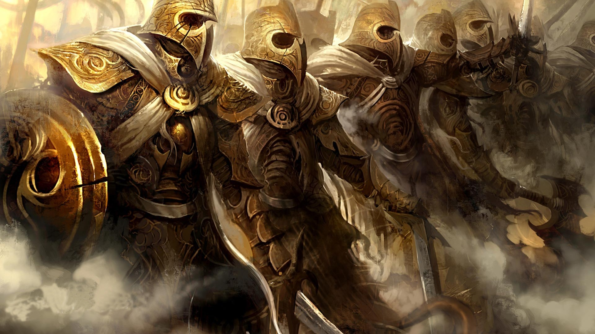

The Children of Javersith lack the strength, speed and sheer might of
many of the other Races of Tal'Vorn, their Goddess not being one of war
or death. They make up for this apparent defeciet however with
willpower, courage, wisdom and a skill with the surgical arts that is
nigh unrivalled. Just like their Goddess, the backs of the Fae are
adorned with the delicate, gossamer wings of insects; butterflies,
moths, bees, wasps and beetles. They move gracefully, even in the midst
of lethal hails of arrows or brutal combat, and the majority find
employment as healers, surgeons and battlefield medics. In this task
they show a destinctive lack of favouritism, healing any that require it
provided that the injured will not instantly turn on the Fae once the
task is done. Many of the Surgeons are pragmatic enough not to bother
any more with certain Races, long experience teaching them that some
creatures simply cannot be redeemed.

Almost as cosmopolitan as the Humans and Soulless-Born, the Duty Bound
have successfully integrated into nearly every city and community on the
face of the planet. They are generally gregarious and kind, though
possessed of a dark wrath if slighted and some, especially those that
embody the Sorrow Aspect of Javersith can be wilfully spiteful. In their
own way, the Gossamer get on well with all the other major Races of
Tal'Vorn, seemingly heedless of the disdain the DragonLords in
particular hold for the Fae though they will not tolerate being called
'The Weak', the insult favoured by the Blood of the Dragon, or 'Insect'
as those native to Vorn City occasionally call them. It is on these rare
occasions the vindictive spite of the Fae can come to the fore, the
insulter being rapidly reminded by it is unwise to insult a Race skilled
in Healing Magic as disease and poison suddenly plagues them, or the
most minor injury becomes a major incident.

The Fae form the majority of the Priesthood of Javersith and the Healer
Sect is unusual in that the majority of its ranks are non-human, being
filled to the rafters with Surgeons of varying skill levels. The Goddess
approves of this level of responsibility and of the honour Her Children
do Her with their good works, many Fae being blessed and touched by the
light of the Merciful One. Indeed of all the major Races, much to the
proselytising Anvar's grief, the Fae are far and away the closest Race
to their Goddess. DragonLords know they are watched by Shaltar, their
AllFather, but only the Fae can prove that their Goddess pays attention
on a regular basis.

## **Opinion of Other Races**

**Angel** - "The SkyBorn suffered greatly once, a very long time ago, of
the Wasting Plague and though we laboured for many months and years we
were unable to find a cure for the blight. Indeed the disease still goes
untreated today, only the direct intervention of the Sky Lord, Aeros
Himself, saving His Children from certain destruction. Ruthless purging
and quarantining is the only method we have of arresting the occasional
outbreak of the Wasting when it rears its head and in this the Angels
are tireless in assisting us. There is a firm friendship between our
Races, especially between ourselves and those of the White Wing, their
own teachers and healers."

**Anvar** - "The Mighty make for interesting patients. Being formed of
living FleshMetal, they lack any form of internal organs and yet still
bleed a golden ichor. It has no resemblance to real blood, seeming to
consist of very little bar light and energy, and yet the loss of it to
excess will kill one of the Steel Fleshed as surely as blood loss would
drop a Human. They are patient enough with us and enjoy joining us in
morning prayers, but be wary as ever with a creature powerful enough to
snap your limbs without really trying. Keep them alive and solid then
they will make for superb defenders and bodyguards."

**Conflaris** - "We hold the Conflaris dearly in our hearts for they are
born of a great dynasty. Crafted by Terra, Javeristh's Divine Husband
and God of the Forge, the Conflaris then had the life breathed into them
by the Irrepressible, our own creators Divine Son, Asgar the Volcano
Lord. That the three Deities, so linked, should see fit to bring us
closer together is natural enough and thus we have a large enclave
within the Conflarian city of Drazzahezz, the Star Beneath The Mountain.
Be wary when healing the Wrestlers, for their blood burns hot and bright
and can sear the flesh without due care. A cut too deep and you will
need a surgeons art yourself."

**DragonLords** - "Apparently the Blood of the Dragon think that we
cannot hear them when they call us "weak" or "inglorious". Frankly we
are not deaf, but why anger the sleeping bear? Let them enjoy their so
called superiority and then, when they come to us for help, remember in
your heart who it is that really holds the power here. Yes, they are
swift and mighty and strong allies, but all their vaunted regeneration
is for nothing to the caress of magic. Without our kindness, patience
and skill, all of their Race would have died in the mud before the walls
of Primus a millennia and a half ago."

**Human** - "We reserve judgement on most Humans until they prove either
the DragonLords or the Merfolk right. Some times they are kind and just
and noble and resilient in the face of all manner of hardships,
especially in the depths of that cesspool of a city, Vorn. And sometimes
they rival even the Bisch and the Pravaii for cruelty, malice,
vindictiveness and pure horrifying hate. Still, they are intelligent and
seem well able to survive in spite of the worst that the planet has
thrown at them, so perhaps we can give them a little more time yet."

**Merfolk** - "Most of the Merkfolk are swift enough to avoid the kind
of damage that requires our attention, but even the fastest creature
alive, a title the Children of the Laughing God compete with the
[Swift](Red_DragonLord "wikilink") for on a regular basis, cannot out
run disease. Be patient with them, for even in pain and in ill-health
they will most likely run their mouths, making jokes and cracking wise
to make light of the situation. It is all part of how the Mirthful cope
with everything around them and not something to be held against them,
no matter how much you may wish to sew their mouths shut."

**Soulless-Born** - "Keep them alive at all costs. The moment the breath
slips from their bodies then they are beyond even our fiercest magics
and most dedicated surgical arts. You absolutely must keep the blood
flowing through the veins of the Doomed for this life is the only thing
they have and for most it is beyond precious to them. We are honoured
serve the Children of Hevar for the Nightbringer is the God of Justice
and His Children do much great and noble work in the world. Some turn to
mercenary work, it is true, and fewer still turn their face away from
the attentions of their God, but they are foolish few in a Race of
nobility and self-sacrifice that some who purport to greater honour
would do well to learn from."

## **Physical Physrep**

All Physreps are optional except for the Primary Physrep unless
otherwise stated.

**Wings**; **Primary Physrep.** - All Fae bear wings like those that
adorn the back of the Bringer of Mercy, Javersith Herself. These vary in
appearance based upon the Aspect of the Goddess that each of the
Surgeons belongs to but even severely damaged wings will eventually grow
back.

  -
    This can be physrepped with appropriate mesh and wire wings, or
    through the usage of an appropriately patterned and cut cloak or an
    'Isis cloak'. Small wings, such as those from playsets or typical
    'dress up kits' are not suitable.

**Aspect of the Goddess**; **Required Choice.** - The Fae are strongly
touched by the gifts of their Goddess and were hand-crafted in days long
gone in order to aid Her in Javersith's holy works. Though the Goddess
has since been seen less and less upon the face of Tal'Vorn, Her
Children still are born into three major Aspects that effect their
mentality, approach to life, looks and the form their wings take. These
Aspects are each a facet of Javersith's divine responsibilities,
reflected into Her Children.

  -
    The Aspects available to play are as follows;
    [Sorrow](Sorrow_Fae "wikilink") "The Uncompromising",
    [Mercy](Mercy_Fae "wikilink") "The Pragmatic",
    [Healing](Healing_Fae "wikilink") "The Hopeful".

**Skin Patterning** - The skin of the Gossamer is often patterned with
colours and markings that are associated with their Aspect. Sorrow Fae
are marked with creeping patterns like vines; Mercy Fae bear geometric,
honey-comb like shapes and Healing Fae are touched with brightly
coloured spirals.

  -
    These can be physrepped with any appropriate make up or tattoo
    paper.

**Pointed Ears** - Many Fae possess delicately pointed ears, similar to
those born by the Goddess Herself.

  -
    These can be physrepped with appropriate 'Elf' or 'Pixie' ears.
    Please note that long ears, ala World of Warcraft, are not suitable.

**Hair** - Even the Sorrow Fae draw the eye with their unusually
coloured hair and this could be said to be one of the defining features
of the Fae.

  -
    These can be physrepped with appropriate temporary dye or a wig of
    suitable colour based upon the Aspect you wish to play.

**Eyes** - Fae often possess big, unusually coloured eyes, the specifics
of which vary with the Aspect of the Goddess to which they belong.

  -
    You can physrep this with an appropriate set of 'big eye' contact
    lenses or simply through make-up intended to give the impression of
    a larger than normal eye.

**Clothing** - The Fae prefer practical items of clothing, easily kept
clean or at the very least rolled up out of the way for whatever task
they wish to partake in. They run counter to this practicality somewhat
in that they also love colour, and often adorn their skin, hair, neck
and wrists with jewellery or hand-crafted items that match or compliment
their shimmering wings and unusual hair colours.

**Weapon Preferences** - Those of the Fae who favour war, who work as
protectors for their kin and their temples, prefer massive shields to
compensate for their relatively low physical durability and heavy, blunt
weaponry to maximise the damage dealt by each blow. Of all the Races on
Tal'Vorn, there are many far more effectively built for the brutality of
close melee than the Surgeons and this is shown in that many prefer
ranged weapons, be it simple bows, complex gunpowder hand-cannon bought
from the Research Sect or a simple and brutally effective thrown
scalpel.

## **Roleplay Effects**

  - **Practical** - Fae of all kinds are inherently practical, even if
    occasionally hopeful. All prepare for the worst even if they think
    it unlikely to happen and are thus usually able to produce a
    required item, antidote, weapon or device in time of need. This
    sense of practicality covers most aspects of their lives, leading to
    them being unfazed by the blood, gore and other such unpleasantness
    that is often an aspect of daily life on Tal'Vorn.
  - **Gentle** - None of the Fae are pre-disposed to violence, though if
    pushed to the point of no choice they can prove to be surprisingly
    competent. Some make the moral choice that combat is often the only
    way to protect the things they hold dear, but most prefer to simply
    attempt to prevent war and conflict. They make for excellent
    diplomats and wise mediators, though they are intelligent enough to
    know when negotiation is a pointless task.
  - **Wilful** - A Gossamer who's mind has been made up is difficult to
    move from their choice. Unlike the Conflaris and DragonLords, who
    often as not are stubborn with opinions as well as choices, a Fae is
    instead well versed in balancing choices and coming to a conclusion
    that they are adamant of. The difference is that a Fae's choice is
    often thought out and intelligent, as opposed to instinctive or a
    product of their upbringing.
  - **Duty Bound** - The Gentle are well known for being completely
    fearless when completing tasks, especially when seeking to aid the
    wounded amidst battle. Many DragonLords and Anvar tell stories of
    being faced down by a diminutive Fae and kept from the killing blow
    of some foe, tinged with their own incredulousness in spite of the
    evidence of their own eyes.

## **Names**

Fae naming conventions depend entirely upon where they were born and
live. Fae in Anvar communes will favour the names of the Eaters of
Metal, whilst Fae in Drazzahezz will typically use the Conflarian naming
methods.

## **Nicknames**

  - The Gentle
  - Gossamer
  - The Weak (insult)
  - Duty Bound
  - The Surgeons
  - Sawbones (insult)
  - Insect (insult - Vorn City Slang)

## **Worship**

For the Fae, their worship of Javersith is a practical, active
consideration. Through the healing of the sick or the saving of the
dying is the Sorrowful honoured, a process that the majority of the
Gossamer take a busy delight in. Not all Fae are healers, however, and
thus some of them prefer to worship in a different fashion. Javersith is
naturally disinterested in physical offerings for herself, but donations
made so that the good works of Her creations can continue are gratefully
received.

Many temples to Javersith, including the Great Temple in the Vorn
Plains, double as hospitals and triage centres, places of work for the
Healer Sect and mundane surgeons alike. After all, even powerful magics
cannot achieve everything and the longer an individual has been wounded
for, the less likely it is that magical means will be enough to restore
them. For this reason many members of the Javersith Priesthood are also
talented surgeons and apothecaries, enabling them to carry on their good
works without relying upon the whims of magic.