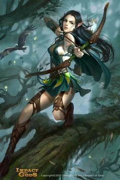

__NOTITLE____NOTOC__

Humanity came to Tal'Vorn almost one and a half thousand years ago and
in that time their population has exploded until they are more numerous
than the Angels, DragonLords, Conflaris, Fae and Soulless-Born put
together. They are resourceful, adaptable, ruthless, manipulative,
deceitful, greedy, vain, noble, courageous, petty, childish and foolish.
Humanity is the true contradictory Race and indeed it is perhaps because
of this that they are so totally hated by so many of the other Races
that occupy the face of Tal'Vorn.

Humans range from five and a half feet to just over six and a half in
height on average, with males being typically taller and heavier then
females. Their hair colours run the usual gauntlet of shades from black
to red to blonde, with eyes doing a similar thing with brown ranging to
green and blue. Skin tones for humans are quite varied, from dark ebony
shades to almost paper white. Humanity is also apparently able to
interbreed with a lot of Tal'Vorns Elder races, resulting in many humans
having at least a smattering of hybrid blood in them, typically Fae,
Soulless or Mermish. DragonLord/Human Hybrids, known as Abominations,
have been known, but typically have a very low life expectancy due to
the violence of DragonLord reactions to such creatures.

Something that does mark Humans out from most of the other Races, but
isn't immediately apparent, is their talent for Psychic Magic.
Originally created and designed by the mysterious Ether Walkers, a
species of Elder Race created by the God of Fate; Timus, Psychic Magic
is powerful and difficult to defend against. Very few other Races,
besides the Ether Walkers, were capable of casting even a simple Psychic
cantrip, until Humanity arrived. The Usurpers mastered the Magic like
every other they have attempted, and have shown worrying skill in it,
exceeding many of the best Psykers amongst the Ether Walkers.

Humans are without doubt the most morally flexible of the Races. Whilst
some of the Elder are braver and more noble and some of them sink to
lower depths of depravity and cruelty, few manage to do so within the
same Race. Adaptable and resourceful, Humans learn quickly, picking up
basic concepts very easily allowing them to capitalise on any possible
opportunities. Whilst they may lack the sheer courage of DragonLords,
the stubbornness of the Conflaris or the irrepressible joy in life of
the Mermen, they still benefit from the broadest range of emotional
responses of any Race, bar the Soulless-Born and the Fae. Indeed
sometimes the apparently extreme emotional reactions of Humans can
confuse and irritate the other Races more than anything else.

## **Opinion of Other Races**

**Angel** - "Useful trading partners when they are in the mood, but
generally the occupants of the Angel Peaks seem to prefer trading with
the other Elder Races. They seem to avoid outright insulting us but are
no friend to our Race, so to speak. There are old stories from the
[War](The_Great_War "wikilink") of our troops being stunned into
absolute submission simply by the presence of the Children of Aeros.
Obviously we give little account to such obviously faux tales, but the
Angels can certainly be intimidating in their own way."

**Anvar** - "Frankly there is little more tedious than a Child of Solar
in full religious flow, declaiming and shouting about the so-called
benefits of worshipping the Blinding One. Its better not to make that
point however as the brute force of an Anvar is second to none bar the
[Black Breed DragonLords](BlackDlord "wikilink") and even then it would
be a close-run thing. They make for useful allies and bodyguards and are
often willing to accept simple ferrous metals in payment which does at
least make things simpler, if not actually cheaper. "

**Conflaris** - "The weapons they make are literally second to none, and
the same could be said of their armour, tools and architecture.
Unfortunately this, combined with their almost total monopoly on iron
and therefore steel, leads to most of what they produce being well out
of the average Mundane's price range and since our species represents
most of the non-casting population, we normally have to make do with
either bronze or stone. Naturally, being intelligent folk, the Conflaris
are happy to hire us as workers and labourers, though the more lucrative
bodyguard positions normally, and somewhat unjustly, go to the more
physically powerful Elder Races."

**DragonLords** - "Fucking frothing, hate-filled, insanity-driven,
black-blooded psychopaths. One or two are more tolerant, especially
those of the [White](WhiteDlord "wikilink") or
[Black](BlackDlord "wikilink") Breeds, but unless you are really sure of
yourself, avoid the [Reptiles](DragonLord "wikilink") at all cost. One
word in the wrong place and you'll be lucky if the only thing that
happens to you is a bloody nose. They might be honourable to the other
Races, but to us? Their word once given apparently means less than
nothing. So, since honour means nothing to them, why should we trust
them or treat them well? Be cautious and return the favour of their
contempt."

**Fae** - "One of the few Races to actually treat us with anything
approaching respect or equality, the Fae are decent, hard-working folk.
They've adapted to our presence in most of our communities and, unlike
most of the other Races, they don't do so in dedicated quarters or
sections of the cities. Indeed the Little Healers seem to go out of
their way to put everybody at their ease and the Temples to Javersith
are both numerous because of them and absolutely vital due to their
secondary role as hospitals. Labouring in the Shrines and Temples is an
excellent way to gain healing or a blessing from the Goddess. Javersith
is a kindly and patient Goddess, and one well worth holding in high
respect."

**Merfolk** - "The city of the Mirthful, Haltimeran, is a strange place
to our eyes. Coral houses, high walkways and a great dome over all, the
shimmering gleam of tropical water reflecting the light from both above
and below. The people are strange enough as well, laughing, irreverent
folk who seem not to understand the concept of hardship. They are
ridiculously swift and agile, able to flee easily from any perceived
threat and thus seem to oddly think that literally nothing is a threat.
This makes them supremely relaxed, cheerful and confident and causes
them to be good allies and excellent hosts. They are generous with food
and drink but keep an eye on your moneypouch for many of the Laughing
Folk are also talented and mischievous pickpockets."

**Soulless-Born** - "Apparently the Damned are supposed to be taken from
Human "stock" and genetically perfected, making them faster, stronger,
tougher and more agile than we are. If this is so, then why are there so
few of them compared to us and why in the Nine Hells are they so
outright unsettling to be around? Those block coloured eyes, no pupil or
sclera, makes it incredibly difficult to read their intent or their
expressions, which does not exactly help to offset the aura of inherent
"wrongness" that the Doomed are surrounded by. This being so, why by all
the various Gods do the other Races seem to have so much regard for the
Soulless-Born and yet so little patience with us?"

## **Physical Physrep**

All Physreps are optional except for the Primary Physrep unless
otherwise stated.

**Hair** - The Invaders do what they can to make themselves appear
impressive and to draw the eye away from the riotous explosion of
colour, excitement and beauty that is many of the Elder Races. Humans
from Noble lineages are more likely to wear their hair in loud and
expressive styles, all the better to draw attention. The Merchant
lineages prefer bright colours to demonstrate their wealth but try to
avoid competing with their 'betters'. Those born to the Working classes
or upon the Streets tend to prefer simply keeping their hair short or
tied back out of the way.

**Jewellery** - Though the poorer classes naturally cannot afford such
excess, the wealthy enjoy displaying this prestige with rings, chains
and bracelets of gold, silver or steel, the ferrous metals being both
rare and thus precious upon Tal'Vorn.

**Clothing** - The preferred garments of Humanity varies depending upon
their social standing. The Noble born are more likely to adorn
themselves in expensive silks, satins, furs and beautifully embroidered
linens, all the better to out-display the Elder Races. The Merchants
prefer richly colour robes, well fitted and well made woollen clothing
and delicately decorated scarves and belts as a counterpoint. The Worker
classes prefer whatever is hard wearing, cheap and tidy. The Street Born
will wear whatever they can scrape together with the small sums of money
they acquire. These habits tend to pass onwards even after a Human
becomes a member of the Sects, the Street and Worker Born preferring to
avoid spending money if possible out of sheer habit.

**Weapon Preferences** - The wealthy can afford the very best weapons,
of long cutting steel, or heavy broad axes of iron and tend to prefer to
display this in combat. Two-handed swords especially are a favoured tool
of the rich as the sheer amount of steel in a four foot blade is beyond
the financial means of all but the most fortunate. The poorer classes
prefer bronze, wood, bone or stone weapons, using simple flint knives or
heavy maces and clubs of the softer metals. A stone mace caves in a
skull just as well as a steel one and at a fraction of the cost.

## **Roleplay Effects**

  - **Clever** - Though not inherently more intellectual than any of the
    other Races and, indeed, like most of them somewhat lacking in
    comparison to the insanely intelligent Ether Walkers, the Humans do
    have an odd talent for picking up concepts and the basics of a new
    skill extremely rapidly. They excel at academic research and
    innovation, which goes a long way towards explaining their
    predominance in the Research Sect.
  - **Adaptable** - Humans have cities on every continent, every
    hemisphere and every climate on the planet. They have expanded,
    spread and flourished across the entire world, despite Tal'Vorn's
    best efforts to kill them off. This flexibility and adaptability
    crosses over into other aspects of their lives, leading to the
    Invaders being swift to change tactics and adopt new concepts which
    the other Races would have difficulty accepting.
  - **Persecuted** - The Starborn are well aware of the fact that they
    are almost universally reviled by the rest of the planet, that they
    are hated, detested and that by far the majority of the other Races
    would not lift a finger to save them. Due to this, Humans tend to be
    patient and resilient under threats, insults and mockery, accepting
    the attacks as simply part and parcel of daily life.
  - **Defiant** - Though persecuted and hated, the Invaders still refuse
    to take violence or assault lying down. Physically they may not be a
    match for many of Tal'Vorn's occupants, but that does not prevent
    them from defending themselves to the death if need be. They are
    patient and accepting of mockery, yes, but they are not passive and
    will not tolerate physical attacks.

## **Names**

Humans are as flexible in their names as everything else they do,
typically using names that the parent simply finds interesting or
amusing at the time. As such, Humanity uses any and all of the naming
conventions of the other Races.

## **Nicknames**

  - Starborn
  - Usurper (insult)
  - Traitor (insult)
  - The Numerous
  - The Adaptors
  - Invader (insult)
  - Cowards (insult)
  - Ape (insult - Vorn City Slang)

## **Worship**

Without a progenitor deity the Humans instead worship a grab-bag of the
Pantheons as is appropriate for the situation. Zarner and Javersith to
protect the dying, Shaltar and Lilar when going to war, Hevar and The
Lady when in need of justice and to Vriclar and Nares to help the crops
and animals grow strong. It is broadly unknown what opinion the Gods may
have of this scatter-gun approach to worship. Some of the Numerous do
choose to dedicate themselves to a single deity, but most often this is
due to them being the patron God of a Sect that the Human in question is
a member of or because the Starborn feels a personal, particular call to
that God.

[Timus](Timus_the_Visionary "wikilink") is the only one of the Gods, bar
of course the ever patient
[Javersith](Javersith_the_Sorrowful "wikilink"), to hold much opinion of
the Adaptors. Being one of the few Races able to invoke Psychic magic,
the Humans are a source of some fascination to the Visionary, as the
power of the mind was once a gift restricted purely to the gangly,
grey-skinned Ether Walkers and the elusive, phase-shifting Ilarn. Due to
this interest, Timus is actually more likely than most of the Gods to
answer the prayers and requests for blessings of the Invaders in a
positive manner.