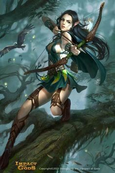

__NOTITLE____NOTOC__

Before the arrival of Humanity, there were two forms of the Soulless;
the hulking Abaddon and the instectile, clever Myrmidon. After the
[Invaders](Human "wikilink") landed, the
[Nightbringer](Hevar_the_Nightbringer "wikilink") saw the potential
inherent in the adaptable and resilient Race. The Soulless-Born were
crafted, like all the Races, by the God Himself, made of Human stock,
but like all the Children of Hevar, they lacked that inherent vital
spark, that unique property of all the other Races; an immortal Soul.
Hevar is not given to idle cruelty, and He has good reason for denying
His creations a soul; the vile Mist Devils, creations of the Dark God,
drink the living souls of their victims. Crafted to war with these
monstrous beings, the Soulless-Born have but one lifetime and one
opportunity to change the face of Tal'Vorn for the better. All living
things, if they are fortunate enough to fall close enough to a Caster of
the [Healer Sect](Healer_Sect "wikilink"), can potentially be brought
back to life through Resurrection, but this option is beyond the
LawBorn.

The Soulless-Born do not maintain communities of their own, preferring
to live amongst the cities and towns of the other Races, all the better
to ensure at least one of their number is present in case a Mist Devil
tries to assault innocents. Though not all of Hevar's Children are
dedicated to the War

Almost as cosmopolitan as the Humans and Soulless-Born, the Duty Bound
have successfully integrated into nearly every city and community on the
face of the planet. They are generally gregarious and kind, though
possessed of a dark wrath if slighted and some, especially those that
embody the Sorrow Aspect of Javersith can be wilfully spiteful. In their
own way, the Gossamer get on well with all the other major Races of
Tal'Vorn, seemingly heedless of the disdain the DragonLords in
particular hold for the Fae though they will not tolerate being called
'The Weak', the insult favoured by the Blood of the Dragon, or 'Insect'
as those native to Vorn City occasionally call them. It is on these rare
occasions the vindictive spite of the Fae can come to the fore, the
insulter being rapidly reminded by it is unwise to insult a Race skilled
in Healing Magic as disease and poison suddenly plagues them, or the
most minor injury becomes a major incident.

The Fae form the majority of the Priesthood of Javersith and the Healer
Sect is unusual in that the majority of its ranks are non-human, being
filled to the rafters with Surgeons of varying skill levels. The Goddess
approves of this level of responsibility and of the honour Her Children
do Her with their good works, many Fae being blessed and touched by the
light of the Merciful One. Indeed of all the major Races, much to the
proselytising Anvar's grief, the Fae are far and away the closest Race
to their Goddess. DragonLords know they are watched by Shaltar, their
AllFather, but only the Fae can prove that their Goddess pays attention
on a regular basis.

## **Opinion of Other Races**

**Angel** - "The Children of Aeros are both blessed and cursed by the
touch of [the SkyLord](Aeros_the_Valorous "wikilink"). Their caste
system is restricitve and frankly bordering on the draconian but at
least they know every day that Aeros inflicted it upon them to save them
from the scheming of the [Dark God](The_Dark_God "wikilink"). Being born
to best the Liar, we sympathise with the [SkyBorn](Angel "wikilink") but
the Angels don't seem to have much interest in us beyond, occasionally,
our skills at war and against the more unnatural of Tal'Vorns denizens;
the [Demons](Demons "wikilink"), [Woken Dead](Woken_Dead "wikilink"),
[Bisch](Bisch "wikilink") and especially the [Mist
Devils](Mist_Devils "wikilink") They are noble and brave, true, as
befits the creations of the Valiant, but too locked into the jobs and
tasks they are born into, making their society brittle and vulnerable."

**Anvar** - "At least we are not the only ones that have been damned by
the choices made by our creators. We lack souls but at least we know we
are damned. Who actually knows what happens to the souls of the
[Mighty](Anvar "wikilink") when [Solar](Solar_the_Blinding "wikilink")
cares so little? The Steel Fleshed are well named but just seem to lack
any kind of common sense or pragmatism, drowning it all beneath blind
religious fervour instead. Mind you, suppose we are guilty sometimes of
something similar when it comes to trying to prove ourselves to
[Hevar](Hevar_the_Nightbringer "wikilink"). The difference is that
sometimes the Nightbringer listens."

**Conflaris** - "The [Resilient](Conflaris "wikilink") make for
excellent friends and trusted associates, being honest and forthright.
Their adherence to the rule of law and the tenants of an agreement is
also frankly admirable. The only real flaw the Fire Born possess, if one
had to pick, is a tendency towards enjoying life a touch too much. The
Stonebones fondness for feasting, wrestling and, most of all, getting
outrageously drunk can be occasionally good fun to partake in, but too
much indulgence distracts us from the good fight against the minions of
the Liar. Still, no one makes finer weapons and armour and no-one makes
a purer, sharper steel, ideal for slicing the eyes from a Mist Devil."

**DragonLords** - "The [First Born](DragonLord "wikilink") revel in the
nigh limitless attention that
[Shaltar](Shaltar_the_AllFather "wikilink") thrusts upon His creations.
Every fight they walk into the Berserkers demand that the Dragon observe
and apparently the Lord of War has nothing better to do than obey\!
Prayers are answered left, right and centre whilst we are fortunate to
even know if Hevar has seen what we have done, let alone approve of it.
Their sense of honour is impressive but beyond their drive to keep their
word, the Blood of the Dragon has little interest in the rule of law. To
make matters worse, the idea of justice which they possess is infinitely
closer to revenge than we are strictly comfortable with."

**Fae** - "Some of the [Gossamer](Fae "wikilink") are driven and
pragmatic, some are kindly and patient and a small percentage are just
vindictive and almost callous. Though you can tell them apart, sometimes
you simply have to deal with a [Sorrow Fae's](Sorrow_Fae "wikilink")
whims, take your licks and just get on with your day. The Temples of
[Javersith](Javersith_the_Sorrowful "wikilink"), on the other hand, are
one of the finest institutions on the planet. Providing full, efficient
healthcare and magical healing in exchange for minor monetary donations
or the offer of physical labour for a few hours? Far and away the best
and fairest agreement you are going to find anywhere on the planet."

**Human** - "We were born of the [Usurpers](Human "wikilink") base
stock, though our siblings; the insectile Myrmidon's and brutally
powerful Abaddon's, were crafted from scratch. We obviously cannot
comment on the inherent mentality of Humanity but judging from the
reactions of the other Elder Races . . . we tend to wish we looked like
just about any other Race. They are nigh impossible to generalise,
virtually impossible to classify and irritatingly hard to trust. They
seem to actively dislike us, though if that is due to our genetic
superiority, physical improvements or simply due to our skills at
inflicting fear is unclear. Some of them are more honourable than the
most determined DragonLord and yet others more conniving than the most
cunning of [Stricken.](Pravaii "wikilink") We share meat but little
beyond that and consider ourselves fortunate that most of the other
Elder Races are content with the difference."

**Merfolk** - "Untrustworthy and sly, the
[Oceanborn](Merfolk "wikilink") are deeply annoying and impossible to
pin down to an agreement. It's fucking irritating."

## **Physical Physrep**

All Physreps are optional except for the Primary Physrep unless
otherwise stated.

**Soulless**; **Primary Physrep.** - The eyes are the window to the
soul, so they say, and it is thus fully appropriate that the eyes of the
Soulless-Born are far and away the most disturbing part of them. They
come in five differing colours, and each one is without pupil or sclera,
appearing instead as an orb of a single solid colour. The colours that
Soulless-Born have been known to exhibit are as follows, in order of
most to least common; Black, Red, Blue, Green and Purple.

  -
    This can be physrepped with suitably coloured solid-tone contact
    lenses. PLEASE DO NOT WEAR FULL SCLERA LENSES. Whilst those are
    ideal for the look we aiming to achieve, they are currently -NOT-
    designed to be worn all day and thus would not be safe for a player
    to use. Should you have difficulty with putting in lenses we would
    ideally suggest playing one of the other seven Races available.
    However, if you are determined, than appropriate make-up in the
    correct colours in the cracks of the face around the eyes is
    acceptable. A very quick Google search found these; -
    <http://www.coloured-contact-lenses.co.uk/Solid-Tone-Coloured-Contact-Lenses>

**Hair** - Unlike the [Invaders](Human "wikilink"), Soulless-Born do not
possess the same immense inferiority complex and thus feel no pressing
need to visually compete with the other Races. Though some of them may
well favour fantastical or loud styles and colouration of their hair,
the majority favour simply tying to back out of the way or keeping it
cropped short, an indicator of their usual pragmatic mentality.

**Clothing** - The Eyeless are fairly uninterested in excessively
expensive clothing, preferring practical items, made of hard-wearing
materials. Being enduring and physically powerful, the LawBorn quite
often spend most of their time in at least rudimentary armour, since
only having one lifetime and no soul tends towards making them more
cautious. The Doomed prefer heavier armour to light, trusting to their
improved strength to offset the weight and reduction in agility.

**Weapon Preferences** - Physically the Soulless-Born are more powerful
than their human originators, and thus find greater use in heavier
weaponry, be it axes, hammers or two-handed weaponry. Most of the Third
Breed are members of one of the Sects, their Race being inclined
strongly towards either magic or the martial skills, and thus they can
afford items constructed from the more expensive materials. As befits
their occasionally nihilistic outlook, they tend to prefer unadorned,
utilitarian weaponry, with clean lines and a well-constructed form.

## **Roleplay Effects**

  - **Fair** - Though not inherently more intellectual than any of the
    other Races and, indeed, like most of them somewhat lacking in
    comparison to the insanely intelligent Ether Walkers, the Humans do
    have an odd talent for picking up concepts and the basics of a new
    skill extremely rapidly. They excel at academic research and
    innovation, which goes a long way towards explaining their
    predominance in the Research Sect.
  - **Patient** - Humans have cities on every continent, every
    hemisphere and every climate on the planet. They have expanded,
    spread and flourished across the entire world, despite Tal'Vorn's
    best efforts to kill them off. This flexibility and adaptability
    crosses over into other aspects of their lives, leading to the
    Invaders being swift to change tactics and adopt new concepts which
    the other Races would have difficulty accepting.
  - **Realistic** - The Starborn are well aware of the fact that they
    are almost universally reviled by the rest of the planet, that they
    are hated, detested and that by far the majority of the other Races
    would not lift a finger to save them. Due to this, Humans tend to be
    patient and resilient under threats, insults and mockery, accepting
    the attacks as simply part and parcel of daily life.
  - **Nihilistic** - Though persecuted and hated, the Invaders still
    refuse to take violence or assault lying down. Physically they may
    not be a match for many of Tal'Vorn's occupants, but that does not
    prevent them from defending themselves to the death if need be. They
    are patient and accepting of mockery, yes, but they are not passive
    and will not tolerate physical attacks.

## **Names**

Soulless-Born take after the Humans and, indeed, the Fae, in that their
naming conventions vary wildly and draw primarily upon the city or
location in which they grew up. However unlike with Humans, the [Blood
of the Dragon](DragonLord "wikilink") are unlikely to take offence at
one of the Fearless having a DragonLord name.

## **Nicknames**

  - The Third Breed
  - Freak (insult)
  - Eyeless (insult)
  - The Unyielding
  - LawBorn
  - The Doomed (impolite statement of fact)
  - The Fearless
  - Husk (insult - Vorn City Slang)

## **Worship**

The worship of [Hevar](Hevar_the_Nightbringer "wikilink") is a bit of a
sensitive subject for the Soulless-Born. Whilst many of the Unyielding
recognise that they were created for a task and that fulfilling that
task is both an honour and a duty, some of the Soulless-Born rebel and
turn to other, darker Gods in a bid for the same immortality that the
other Races enjoy. Active worship of Hevar had petered out when the God
was presumed killed some time around 500AL (After Landing) since a dead
God cannot respond to worship, grant miracles or even provide comfort.
However recently the Nightbringer has been seen in person on the streets
of Vorn, causing a resurgence in the Hevarian faith.

Worship is known to be most effective and most appreciated when the
light fades from the sky and the night starts to draw in. Vows to bring
evildoers to justice and acts of the same are viewed with approval by
the God of Law, especially when such acts are unblinded by a need for
revenge or done without malice or spite. Satisfaction in a job well done
is understandable but the Law and thus Justice should always be
impartial, fair and just. Hevar also, according to legend, is willing to
intercede on behalf of the dead with His Divine Brother, [Zarner the
Patient](Zarner_the_Patient "wikilink"), helping to ensure that those
departed have a swift and safe journey either down the River Styx to the
God of the Dead's embrace or to the halls of their chosen God. This
intercession is supposed to be invoked with the traditional prayer of
the dead; "May the River bear you swiftly to your rest and the Patient
One embrace you warmly. Hevar."